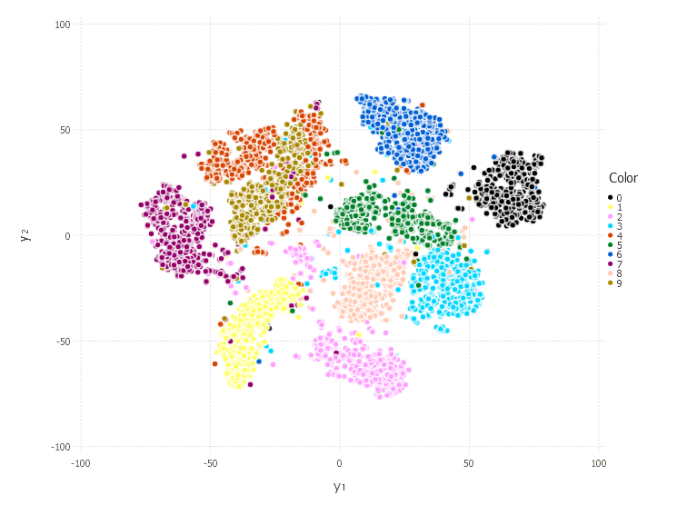

# TSNE.jl
An implementation of the t-Sne algorithm. The main author (Laurens van der Maaten) has information on t-Sne (including papers and links to other implementations) [here](https://lvdmaaten.github.io/tsne/).

To use, run the command:
```jlcon
Pkg.clone("https://github.com/Wedg/TSNE.jl.git")
```
## Algorithm Documentation

A detailed description of t-Sne describing each of the components of the algorithm can be found:  
1. [here as an html](https://Wedg.github.io/tsne/tsne.html) file, or  
2. [here as an ipynb file](demo/t-SNE_demo.ipynb) that you can run in Jupyter.

## Using TSNE.jl

The main function to use is `tsne` which is run as follows:
```jlcon
tsne(X, d, [perplexity = 30.0, perplexity_tol = 1e-5, perplexity_max_iter = 50,
            pca_init = true, pca_dims = 30, exag = 12.0, stop_exag = 250,
            μ_init = 0.5, μ_final = 0.8, μ_switch = 250,
            η = 100.0, min_gain = 0.01, num_iter = 1000])
```
with `X` containing the data with features in rows and observations in columns.

All the options are described in more detail by running the help request i.e.
```jlcon
?tsne
```
which shows:

### Input types
- `F::AbstractFloat`
- `T::Integer`

### Arguments
- `X::Matrix{F}`: Data matrix - where each row is a feature and each column is an observation / point
- `d::T`: The number of dimensions to reduce X to (e.g. 2 or 3)

### Keyword arguments and default values
- `perplexity::F = 30.0`: User specified perplexity for each conditional distribution
- `perplexity_tol::F = 1e-5`: Tolerence for binary search of bandwidth
- `perplexity_max_iter::T = 50`: Maximum number of iterations used in binary search for bandwidth
- `pca_init::Bool = true`: Choose whether to perform PCA before running t-SNE
- `pca_dims::T = 30`: Number of dimensions to reduce to using PCA before applying t-SNE
- `exag::T = 12`: Early exaggeration - multiply all pᵢⱼ's by this constant
- `stop_exag::T = 250`: Stop the early exaggeration after this many iterations
- `μ_init::F = 0.5`: Initial momentum parameter
- `μ_final::F = 0.8`: Final momentum parameter
- `μ_switch::T = 250`: Switch from initial to final momentum parameter at this iteration
- `η::F = 100.0`: Learning rate
- `min_gain::F = 0.01`: Minimum gain for adaptive learning
- `num_iter::T = 1000`: Number of iterations
- `show_every::T = 100`: Display progress at intervals of this number of iterations


## 2D MNIST example
<p align="center">
  
</p>
